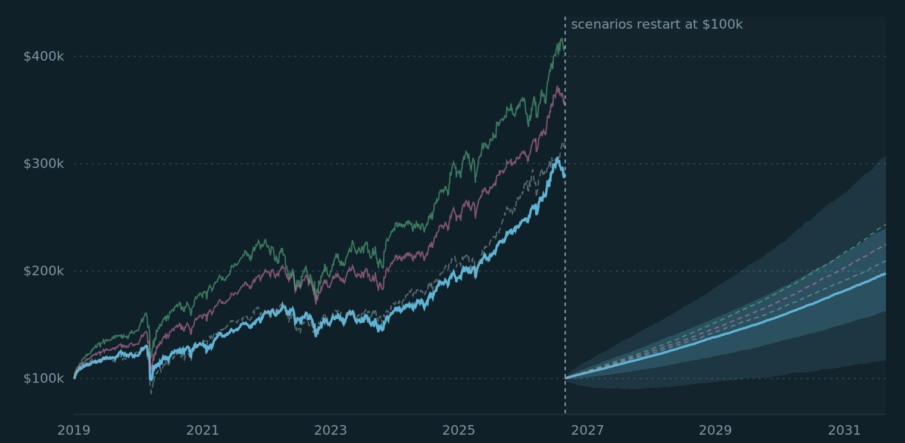
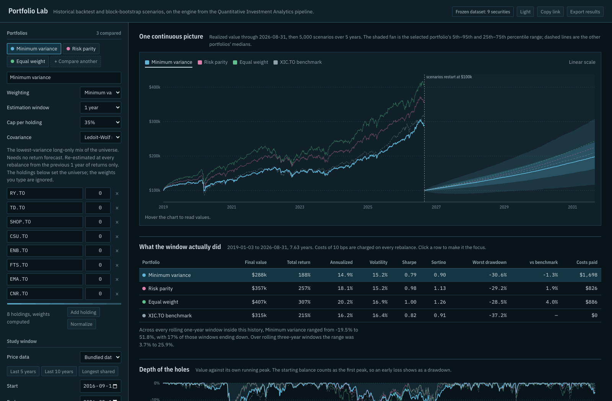
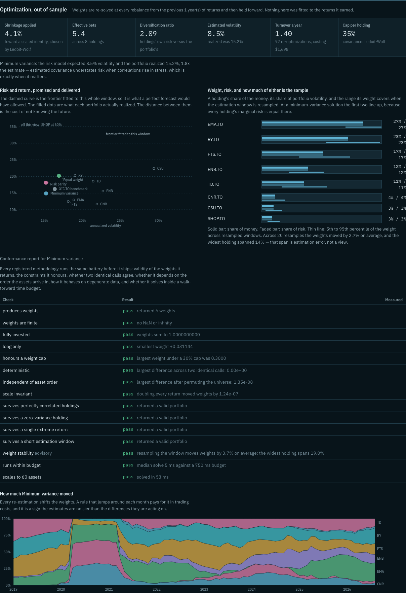
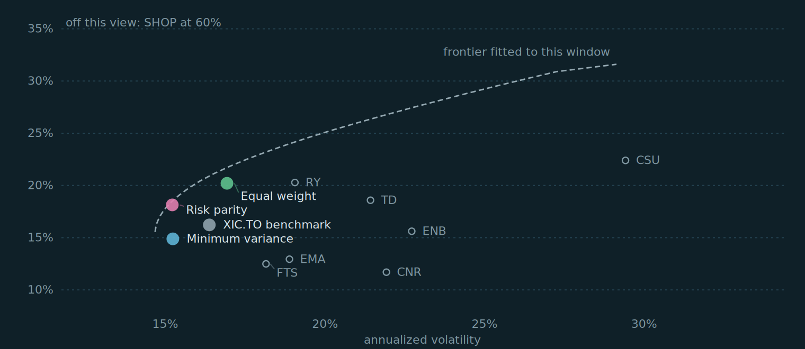
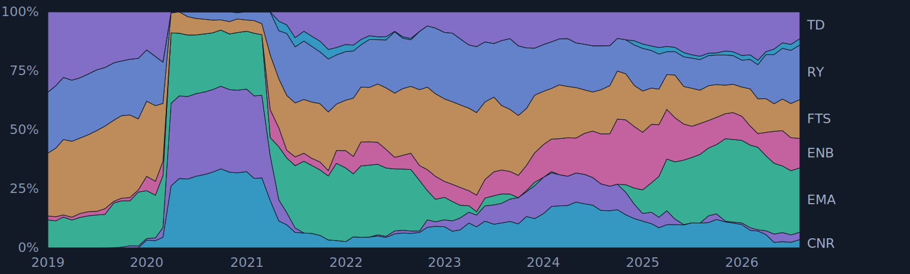
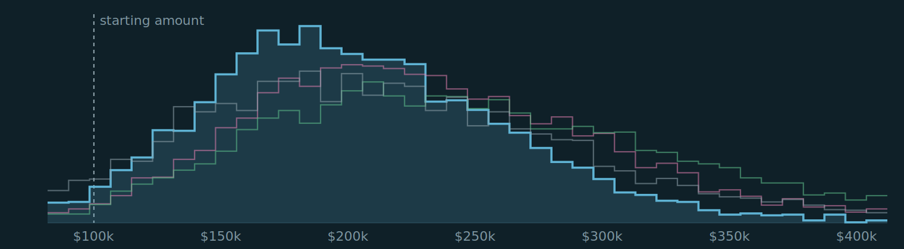
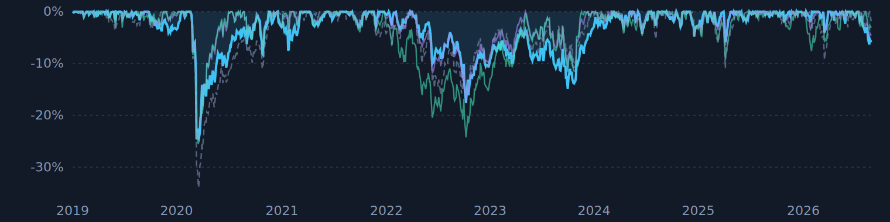
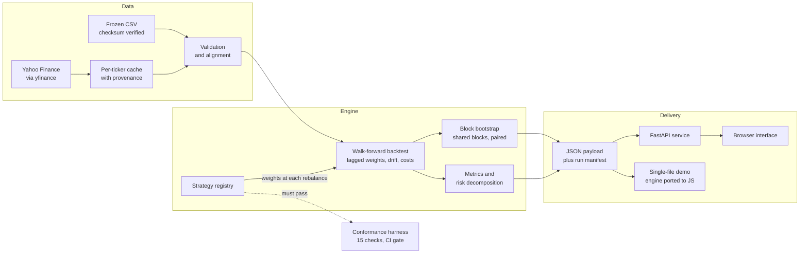

<p align="center">
  
</p>

# Strata

**A reproducible research pipeline and portfolio construction bench: compare allocations, test risk, and translate quantitative methods into auditable software.**

[Launch Strata](https://nathan-portfolio-lab.onrender.com/) · [Open the offline demo](https://www.nathan-gomes.com/strata-demo.html) · [Read the case study](https://www.nathan-gomes.com/Project-Investment-Analytics.dc.html)

The live app supports Yahoo Finance tickers and Python optimization. The offline demo uses nine frozen securities and runs minimum-variance and risk-parity optimization in your browser. Other optimization methods and live tickers require the Python app. Neither places trades.

[](https://github.com/Nathan-Gomes/quant-investment-analytics-etl/actions/workflows/test.yml)




*One continuous axis. Realized portfolio value through the end of the study window, a dashed seam, then five years of block-bootstrap scenarios. The shaded fan is the selected portfolio's 5th–95th and 25th–75th percentile range; the dashed lines are the other portfolios' medians, drawn on identical sampled market sequences.*

---

## What this is

Three things, in one repository.

**A research pipeline.** Adjusted price history to a validated SQLite mart and an offline HTML report, with every calculation, cost assumption and data check made explicit. It compares four Canadian equity allocations against the XIC benchmark from 2019 to 2026.

**A portfolio bench.** A web app where any set of tickers and weights can be backtested over any window and projected forward with the same block-bootstrap engine — and where portfolios can be *constructed* rather than only measured, by minimum variance, risk parity, maximum diversification or maximum Sharpe, re-solved at every rebalance from a trailing window.

**A path from research to production.** Construction rules are registered against a contract rather than hard-coded. Every one passes the same conformance battery before it ships, and every result carries a manifest that says exactly what produced it.

## Quick start



*The research bench with portfolio controls, historical results and conditional scenarios. This reproducible example explicitly uses the frozen dataset.*

Analyses report live progress and elapsed time. Concurrent downloads and a
vectorized sampler improve responsiveness without changing the random sequence.

```sh
python3 -m venv .venv && source .venv/bin/activate
pip install -r requirements.txt -r requirements-app.txt

python -m src.pipeline --source cached   # the research pipeline -> output/report.html
python -m app.server                     # the bench -> http://127.0.0.1:8000
python -m pytest -q                      # full regression suite
python -m app.conformance                # the methodology gate
```

`python tools/build_demo.py` produces `dist/strata-demo.html`: the whole bench in one file, engine included, running in the browser on the frozen dataset with no server and no network.

## What it found

CAD 100,000 from 3 January 2019 to 31 August 2026. Adjusted prices, monthly rebalancing, 10 bps of cost on traded notional.

| Portfolio | Annualized | Volatility | Sharpe | Max drawdown |
| --- | ---: | ---: | ---: | ---: |
| Growth | 27.80% | 28.60% | 0.90 | −48.72% |
| Balanced | 19.12% | 16.29% | **0.97** | −28.73% |
| Low volatility | 17.57% | 15.29% | 0.94 | −29.71% |
| Income | 16.13% | 16.06% | 0.83 | −33.06% |
| XIC benchmark | 16.22% | 16.37% | 0.82 | −37.21% |

Growth earned the highest raw return and paid for it in drawdown. Balanced earned the most per unit of risk in this sample.

### And a less comfortable finding

Running the optimizers walk-forward over the same universe, re-solving at every rebalance from the trailing year:

| Construction rule | Annualized | Volatility | Sharpe | Turnover a year |
| --- | ---: | ---: | ---: | ---: |
| Minimum variance | 14.89% | 15.23% | 0.79 | 1.40 |
| Risk parity | 18.14% | 15.21% | 0.98 | 0.55 |
| **Equal weight** | 20.21% | 16.93% | **1.00** | 0.39 |
| XIC benchmark | 16.22% | 16.37% | 0.82 | — |

Walk-forward minimum variance underperforms equal weighting in this selected sample and trades more frequently. This is consistent with the estimation-error concern studied by DeMiguel, Garlappi and Uppal (2009), but is not a replication of their study or proof of the cause of this result.

---

## Inside the bench



*Trailing-window construction, risk contributions and methodology checks from a completed Python app run.*

### Risk and return, promised and delivered



The dashed curve is the efficient frontier fitted to the *whole* window, so it uses hindsight. The filled dots show realized walk-forward results. Their separation does not isolate estimation error from costs, constraints or changing allocations.

### How much an optimizer moves



Every re-estimation shifts the weights — here the 35% cap binds on one holding for the entire period. A rule that jumps each month pays for it in trading costs, and the churn is a sign the estimates are noisier than the differences they are acting on.

### Where the scenarios land



Five thousand paths of 20-session blocks resampled from each portfolio's own completed returns, every portfolio given identical block positions so a comparison is paired rather than a lucky draw. The app reports the median, the 5th and 95th percentiles, the probability of ending below the starting balance, and the drawdowns along the way.

### Depth of the holes



---

## Methodology

### The conventions, stated

- Daily return is current adjusted close over previous, minus one.
- Portfolio gross return is the **previous close's** weights times each asset's current return, so no holding is ever set using the return it earns.
- Weights drift between rebalances. A rebalance charges `pre-cost NAV × Σ|weight change| × bps / 10,000`, counting both sides.
- Annualized return compounds wealth to the power of 252 over observed days. Volatility is the sample daily standard deviation times √252. Sharpe uses a constant risk-free rate converted to a daily equivalent.
- Drawdown includes the starting balance as the first peak, so an early loss shows as one.
- Tickers from different exchanges keep only the sessions on which every holding traded. A dropped day is safer than a carried-forward price, which would invent a zero-return session.

Full detail in [`docs/README_pipeline_detail.md`](docs/README_pipeline_detail.md).

### Portfolio construction

Objectives are written as **convex programs** and solved by a conic solver, which
returns a certified global optimum, a shadow price for every binding constraint,
and a definite "infeasible" — with the arithmetic that shows why — when a mandate
cannot be met. Risk parity is the clearest case: written as "minimize the
dispersion of risk contributions" it is not convex, and a local search on it left
a 3.4 percentage point spread across contributions at 40 assets; written as
`min ½wᵀΣw − Σ bᵢ log wᵢ` it is convex, unique, and reaches 3.5e-6.

Risk is estimated three ways — sample, Ledoit-Wolf shrinkage, and a **statistical
factor model** `Σ = BBᵀ + D` whose factor count is the number of eigenvalues above
the Marchenko-Pastur noise edge rather than a tuned parameter. The factor form is
what makes a large universe tractable: 500 names solve in 15 ms against 177 ms
dense, and the portfolio's variance splits into common and specific parts.

Mandates carry what a real book runs under: position caps, sector and country
limits, turnover budgets, tracking-error ceilings, and a convex market-impact
term in the objective so the cost of reaching a portfolio is weighed against the
risk it saves. [`docs/OPTIMIZATION.md`](docs/OPTIMIZATION.md) covers the
formulations and what they still do not do.

Covariance is estimated with **Ledoit-Wolf shrinkage** toward a scaled identity, the intensity estimated from the data and reported in the interface. With 25 assets and a year of daily data a sample covariance matrix fits 325 parameters on 252 observations, and its smallest eigenvalues — precisely the directions a variance minimizer loads into — are the worst estimated. Expected returns, where an objective needs them, are shrunk toward the cross-sectional mean; three of the four objectives need none at all.

Solver restarts are used only where the objective is non-convex. Minimizing a positive-definite quadratic over a convex set has one optimum, so multi-start there buys nothing and costs a multiple of the run time.

### Forward scenarios

A block bootstrap of each portfolio's own completed net returns, never a price forecast. Sampling consecutive blocks preserves volatility clustering. It repeats the window's return distribution, including its luck and its regime — it is not an estimate of future returns, and the median at successive dates is not a path anyone could have held.

---

## From a researcher's rule to running software

A methodology is a function from a context to a weight vector, registered with metadata. Nothing else changes: the API advertises the registry, the interface builds its menu from it, and the walk-forward loop runs anything in it.

```python
register(Strategy(
    name="inverse_variance",
    label="Inverse variance",
    description="Weights proportional to the reciprocal of each holding's variance.",
    solve=inverse_variance,
    author="r.chen",
))
```

Then it faces the same gate everything else passed:

```
$ python -m app.conformance --strategy inverse_variance --verbose

PASS  inverse_variance
  ok  fully invested: weights sum to 1.0000000000
  ok  honours a weight cap: largest weight under a 30% cap was 0.3000
  ok  deterministic: largest difference across two identical calls: 0.00e+00
  ok  independent of asset order: largest difference after permuting: 7.48e-09
  ok  survives perfectly correlated holdings: returned a valid portfolio
  ok  survives a zero-variance holding: returned a valid portfolio
  ok  weight stability: resampling moves weights by 3.7% on average
  ok  runs within budget: median solve 8 ms against a 750 ms budget
  ok  scales to 60 assets: solved in 67 ms
```

Fifteen checks, identical data for every methodology, non-zero exit on failure, run in CI beside the unit tests. Each exists because that class of failure is silent: the code returns a plausible weight vector and the damage only appears in the P&L. `tests/application/test_strategies.py` defines methodologies broken in each of those ways and asserts the harness fails them on the check that names the fault.

The battery earned its place on its first run by failing `maximum_sharpe` on speed, at 1,070 ms against a 750 ms budget. See [`docs/ADDING_A_METHODOLOGY.md`](docs/ADDING_A_METHODOLOGY.md).

## Architecture



## Validation and reproducibility

| Property | How it is held in place |
| --- | --- |
| The bench agrees with the research pipeline | Reproduces `output/portfolio_summary.csv` to nine significant figures; a test fails if it drifts |
| The browser engine agrees with Python | Both draw blocks from the same mulberry32 generator, verified bit for bit; a test runs both over one request and compares |
| Optimized weights are walk-forward | A test rewrites the final month of prices and asserts no earlier weight or NAV moves |
| A methodology is safe to run | A 15-check conformance battery in CI, with tests that prove it fails bad methodologies |
| A result can be traced | Every response carries a run identifier derived from the request, a digest of the price values used, a digest of the source, and the library versions — the same study on the same data always carries the same identifier |
| A study can be shared | The whole setup encodes into the link, so a colleague opens the identical study rather than a description of one |
| Simulation precision is visible | Live results include 95% sampling intervals for estimated percentiles; these do not measure model uncertainty or guarantee future outcomes |
| Three implementations agree | Minimum variance and risk parity are solved by cvxpy in Python, by projected gradient and coordinate descent in the browser, and independently in MATLAB. Tests compare all three; CI runs the MATLAB one under Octave |

```
168 tests · 12/12 methodologies conform · report, notebook and demo rebuilt on every push
```

## Project structure

Strata separates the deployed application from the original research pipeline.
Start with the [developer guide](CONTRIBUTING.md) for setup and commands, or the
[architecture guide](docs/ARCHITECTURE.md) for component responsibilities.

```text
matlab/      Independent MATLAB implementation of the two optimizers, used as a
             cross-check; runs in Octave, no toolbox required
app/         The bench: engine, convex optimizer, risk models, strategy
             registry, conformance harness, provenance, market data,
             FastAPI service, interface
src/         The pipeline: extract, validation, analytics, scenarios, report, SQL load
data/        Frozen prices, holdings, security master
sql/         Views using joins, CTEs, aggregations and window functions
tests/
  application/  App, API, optimizer, no-look-ahead and cross-engine parity tests
  research/     Research calculations, validation and reporting tests
scripts/     Research reporting and notebook utilities
tools/       Single-file demo build, cross-language test harness
docs/        Research tour, app guide, methodology guide, deployment notes
notebooks/   Executed research notebook
output/      Published research evidence (not live application state)
.github/     Automated validation and artifact builds
Makefile     Standard development commands: make run, make check, make demo
```

## Limits

Things this doesn't handle well, noted so I don't lose track of them.

- **Survivorship and selection bias.** I picked the universe today, already knowing which names survived and did well. That tends to flatter a backtest, and nothing here corrects for it.
- **The scenario fan isn't a forecast.** It resamples one window's distribution and assumes the future looks something like it.
- **No FX.** Mixing currencies measures each in its own; the app warns instead of converting.
- **Not modelled:** taxes, inflation, cash dividends, delistings, market impact beyond a fixed spread, or spreads widening in stress.
- **A constant risk-free rate** across a decade is a simplification, and Sharpe is fairly sensitive to it.
- **The risk model is statistical, not fundamental.** Its factors don't have economic names, so there's no value or momentum exposure to report.
- **Estimation error is often large.** With a handful of assets and a few years of daily data, the gaps between candidate portfolios can be smaller than the error in the inputs behind them.

I built this to study historical data under assumptions I've tried to spell out. It isn't investment advice, and nothing it produces is a recommendation to buy or sell. Market data use is still subject to the provider's terms.

## References

- Ledoit, O. and Wolf, M. (2004). *A well-conditioned estimator for large-dimensional covariance matrices.* Journal of Multivariate Analysis.
- DeMiguel, V., Garlappi, L. and Uppal, R. (2009). *Optimal versus naive diversification: how inefficient is the 1/N portfolio strategy?* Review of Financial Studies.
- Politis, D. and Romano, J. (1994). *The stationary bootstrap.* Journal of the American Statistical Association.
- [scikit-learn TimeSeriesSplit](https://scikit-learn.org/stable/modules/generated/sklearn.model_selection.TimeSeriesSplit.html) · [yfinance](https://github.com/ranaroussi/yfinance)

## Documentation

| Document | For |
| --- | --- |
| [`docs/REVIEW_GUIDE.md`](docs/REVIEW_GUIDE.md) | A short tour of the research, start to finish |
| [`docs/APP_GUIDE.md`](docs/APP_GUIDE.md) | Running the bench, the API, and its limits |
| [`docs/OPTIMIZATION.md`](docs/OPTIMIZATION.md) | Convex formulations, risk models, mandates, and the gaps |
| [`docs/ADDING_A_METHODOLOGY.md`](docs/ADDING_A_METHODOLOGY.md) | The contract, the gate, and a worked example |
| [`docs/DEPLOYMENT.md`](docs/DEPLOYMENT.md) | Deploying it, and what tends to break |
| [`docs/README_pipeline_detail.md`](docs/README_pipeline_detail.md) | Portfolio definitions, conventions, SQL mart, validation rules |
